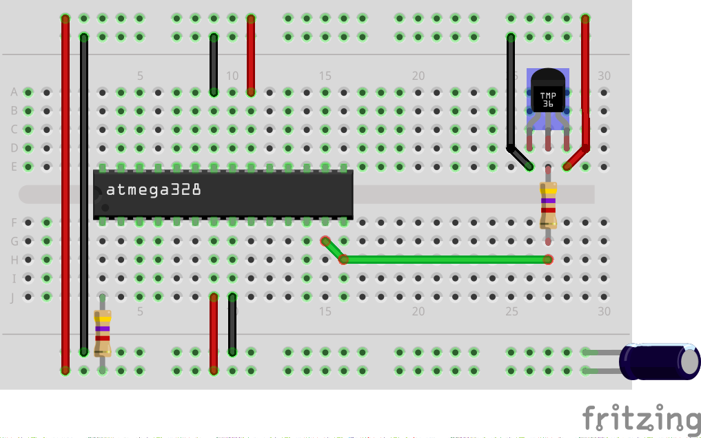

# AVR Dallas1820
This is a library for controlling temperature sensor DS1820 with AVR.

# Features
 - Structures for sensor configuration
 - Functions for reading temperatures and ROMs
 - Allows configuring DS1820 devices
 - CRC support
 - Includes standalone OneWire library

# Examples:

### Reading temperature

```c
#include <stdio.h>

#include <avr/io.h>
#include <util/delay.h>

#include "Dallas1820/Dallas1820.h"

int main( )
{
    float Temperature = 0.0f;

    //Make sensor pin output (optional)
    DDRD = (1 << 7);

    //Sensor configuration (port direction register, port output register, port input register and mask)
    OneWireConfiguration Thermometer = { &DDRD, &PORTD, &PIND, ( 1 << 7 ) };

    Dallas1820ReadROM( &Thermometer ); //Read ROM

    while ( 1 )
    {
        //Request Dallas 1820
        Dallas1820Request( &Thermometer );

        //Read temperature
        Temperature = Dallas18B20ToCelcius( Dallas18B20Read( &Thermometer ) );

        //Use data
        printf( "%f\n", (double) Temperature );

        //Wait 1s
        for ( unsigned char i = 0; i < 100; i++ )
            _delay_ms( 10 );
    }
    return 0;
}

```

# Sample wiring diagram
</img>

This is sample wiring diagram. It shows basic connections between DS1820 and microcontroller. It also works with code snippet above.

**Note: You can use whatever AVR microcontroller You want to, ATmega328 is only example.**
