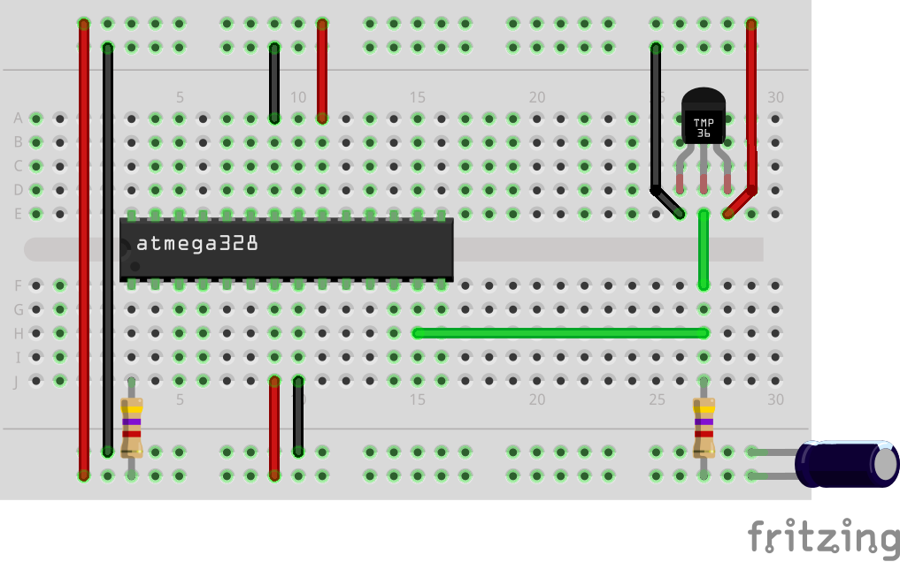

# AVR Dallas1820

[](http://opensource.org/licenses/MIT) [](https://travis-ci.org/Jacajack/avr-dallas1820)

This is a library for controlling temperature sensor DS1820 with AVR.

# Features
 - Structures for sensor confuration
 - Functions for reading temperatures and ROMs
 - Allows confuring DS1820 devices
 - CRC support
 - Includes standalone OneWire library

# Examples

### Reading temperature

```c
#include <avr/io.h>
#include <util/delay.h>
#include <stdio.h>

#include "uart.h"
#include "../include/ds1820.h"

char txt[80];
OnewireConf thermo = { &DDRB, &PORTB, &PINB, ( 1 << 0 ), 0, NULL };

int main( )
{
	uartInit( 9600 );

	while ( 1 )
	{
		//Read temperature
		ds1820request( &thermo );
		sprintf( txt, "raw: %d\n", ds18b20read( &thermo ) );
		uartSend( txt );

		//Delay
		_delay_ms( 1000 );
	}

	return 0;
}

```
To tell library where sensor is connected `OnewireConf` structure is used. You can set up one like this:

```c
OnewireConf thermometer = { &DDRD, &PORTD, &PIND, ( 1 << 7 ) };

```

It means sensor is on connected to port D on pin 7. All pointers need to specify same port registers (direction, output, input). Last member is mask, it tells you about exact pin sensor is connected to. Please remember, you have to allocate memory for storing ROM yourself, otherwise stuff won't work.

All you need to do later is to pass pointer to confuration structure to functions that need it, like that:

```c
ds1820request( &thermometer );
```

This one tells sensor to start internal temperature conversion, and to read it use:

```c
ds18b20read( &thermometer );
```

To read temperature with ROM address matching use function:

```c
ds18b20matchRead( &thermometer );
```

It uses ROM stored in confuration structure. You can get it into there using:
```c
ds1820readROM( &thermometer );
```
You can also read it to array of unsigned characters, like shown below:
```c
ds1820readROMArray( &thermometer, array );
```

By analogy you can also match ROM from characters array:

```c
ds18b20arrayMatchRead( &thermometer, array );
```

This is very basic usage of this library, for more information visit [wiki](https://github.com/Jacajack/avr-dallas1820/wiki).

Library is very easy to compile, just compile each `.c` file and link all `.o` files together.
If you have any problems though, just take look at `makefile`.

# Sample wiring diagram
</img>

This is sample wiring diagram. It shows basic connections between DS1820 and microcontroller. It also works with code snippet above.

**Note: You can use whatever AVR microcontroller you want to, ATmega328 is only example.**
